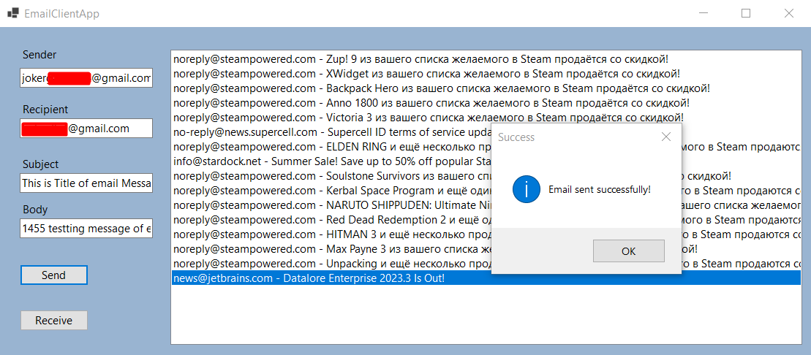
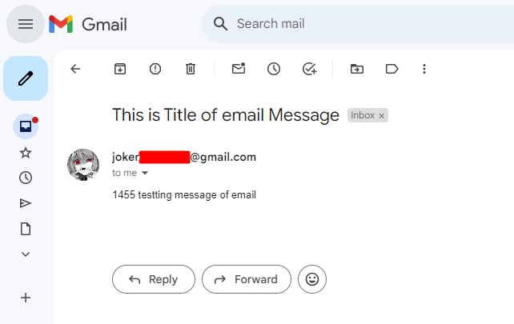

# Email Client Desktop App

Windows Application using .NET 7.0 and Windows Forms, as email protocols for send SMTP and receive POP3, additional nuGet library OpenPop.

## Features

- Email Sending: Send emails to specified recipients with a subject and body.
- Email Receiving: Receive and display emails from the configured email account.

## Demonstration




## Getting Started

### Installation

1. Clone the repository: 
```bash
git clone https://github.com/dotpep/email-client-app
```
2. Open the project in your preferred C# development environment (e.g., Visual Studio).
3. Check Configuration section below.
4. Build and run the application.

### Configuration

Before using the application, follow these steps to configure your email settings:

1. Open project solution and EmailApp.cs file
```csharp
// Email sending configuration btnSend_Click()
int smtpPort = 587;
string smtpUsername = "your_gmail_address_name_@gmail.com";
string smtpPassword = "your_google_app_password";
// Email receiving configuration btnReceive_Click()
int pop3Port = 995;
string pop3Username = "your_gmail_address_name_@gmail.com";
string pop3Password = "your_google_app_password";
```
2. Replace `"your_gmail_address_name_@gmail.com"` with your actual Gmail address.
3. Generate an app password for Gmail by following the instructions [here](https://support.google.com/accounts/answer/185833?hl=en&sjid=10291959553872721365-EU).
4. Replace `"your_google_app_password"` with the app password generated from your Google account.

By completing these steps, your Email Client App will be configured to send and receive emails using the specified Gmail account.

### Prerequisites

- Visual Studio with .NET 7.0
- Gmail Account
- Google App Password - instructions [here](https://support.google.com/accounts/answer/185833?hl=en&sjid=10291959553872721365-EU).
- Network Connection

## Usage

1. Launch the exe file application.
2. Enter the required information in the provided textboxes:
    - Sender's email address
    - Recipient's email address
    - Email subject
    - Email body
3. Click the "Send" button to send the email.
4. Click the "Receive" button to retrieve and display received emails in the list.
5. Select an email from the list to view its details in the designated area.

## Release

- Version: 1.0.0
- Release Date: 02.03.2024

## TODO

- [ ] advanced received emails
- [ ] gmail login in apps using text components
- [ ] release exe file 

## LICENCE

This project is licensed under the [MIT License](LICENSE).